#

## Motivation

According to ["Landmine Monitor 2018"](http://www.the-monitor.org/media/2918780/Landmine-Monitor-2018_final.pdf)

- 7'239 casualties in 2017:
    * 2'793 deaths
    * 4'431 injuries
    * 15 unknown survival status
- 60 states contaminated with antipersonnel mines

##

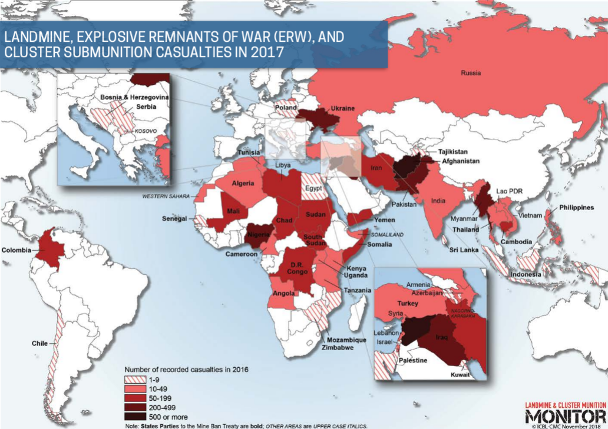

##

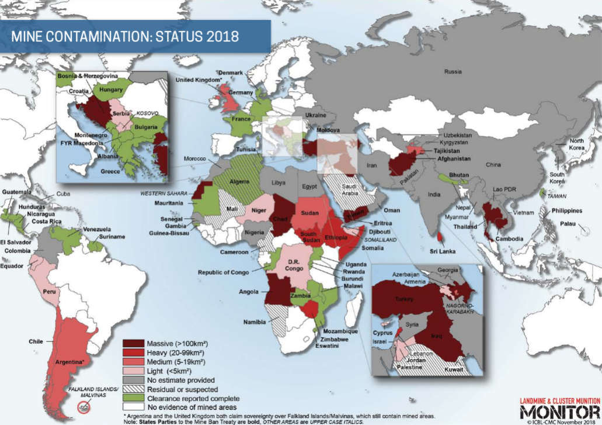

#

## Minesweepers competition

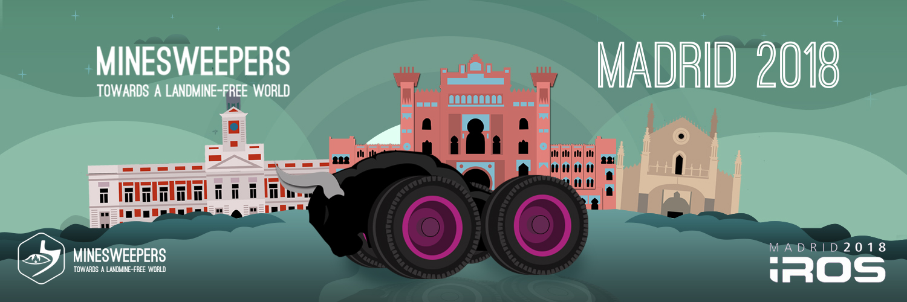

## When/Where?

## Rules

- One or multiple robots
- Autonomous or teleoperated
- 20 minutes to map 400m² outdoor looking for
    * Surface landmines
    * Underground landmines
- Not allowed to touch the mines

#

## Who are we?

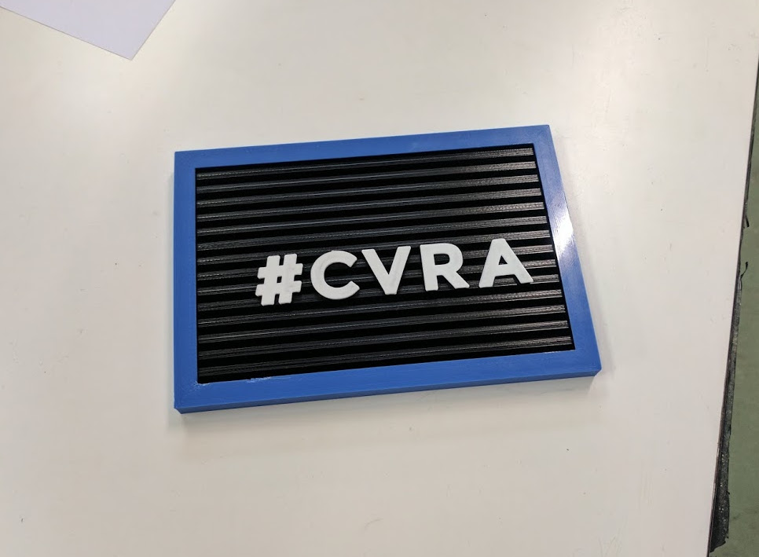

## How many?

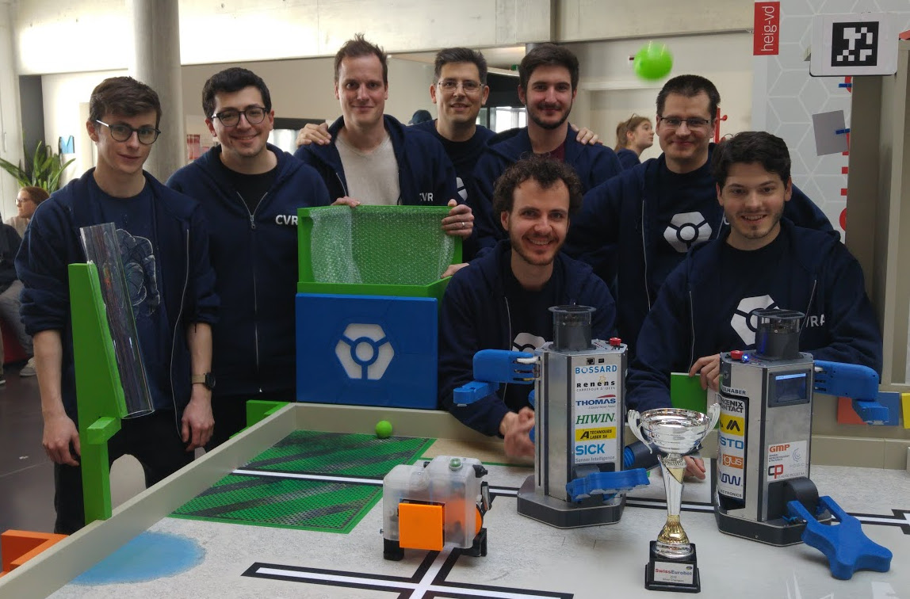

## Where?

Lausanne, Switzerland
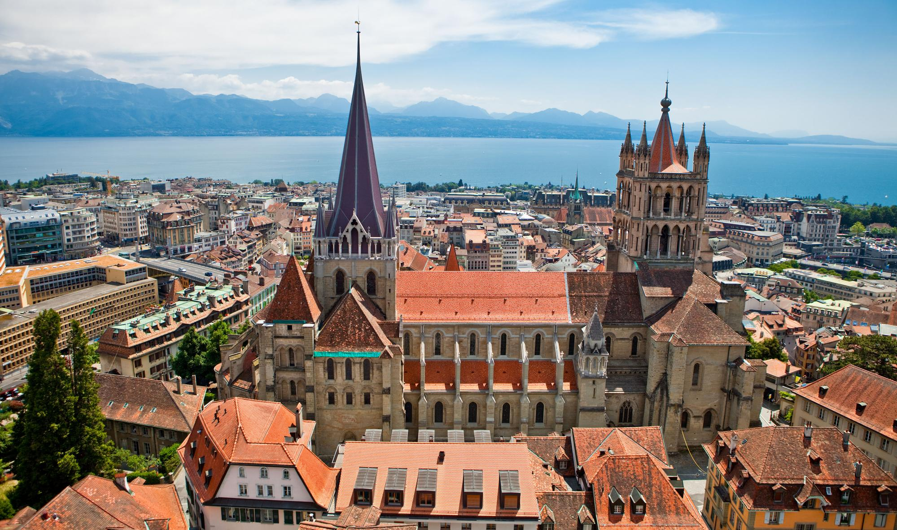

## Goal

Build a rover for the competition in 3 months, with 4 persons, and 500$ + parts

#

## Enter Sisyphus

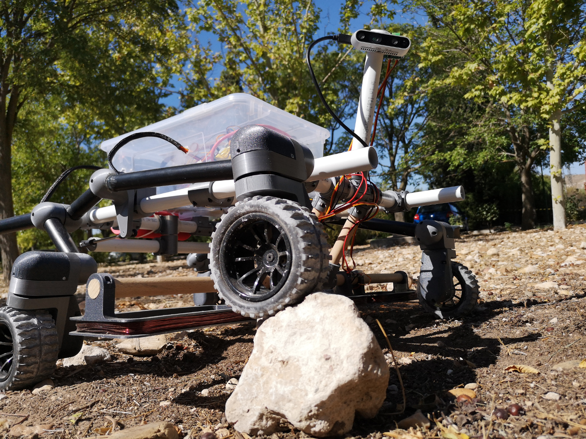

#

## Mechanical design

## Rocker-bogie

## Rocker-bogie

## Driving electronics

- Driving wheels
    * powered by DC motors
    * controlled by Motor boards
- Steering servos
    * controlled by PWM outputs on the Master board

#

## Detecting buried mines

## Detecting buried mines

- Pulse-induction metal detector
- 3 coils on the front of the rover
- Total span of 1m covered

## Detecting surface mines

## Detecting surface mines

- Realsense D435
- RGB + Depth converted to Point cloud
- Point cloud segmented based on geometry
    * Remove the planar background
    * Cluster remaining points
    * Find cluster matching mine size range

#

## Positioning system

Requirements

- Drift-free ➡ 🚫 INS or SLAM
- High-accuracy (<10cm) ➡ 🚫 GPS
- Cheap (<500$) ➡ 🚫 RTK GPS

## Ultra-Wide Band beacons

:::::::::::::: {.columns}
::: {.column width="35%"}

:::
::: {.column width="60%"}
- Custom design
- cm-level range measurement
- High update rate (>100Hz)
- 50$ per board
- Open source
:::
::::::::::::::

## UWB positioning system

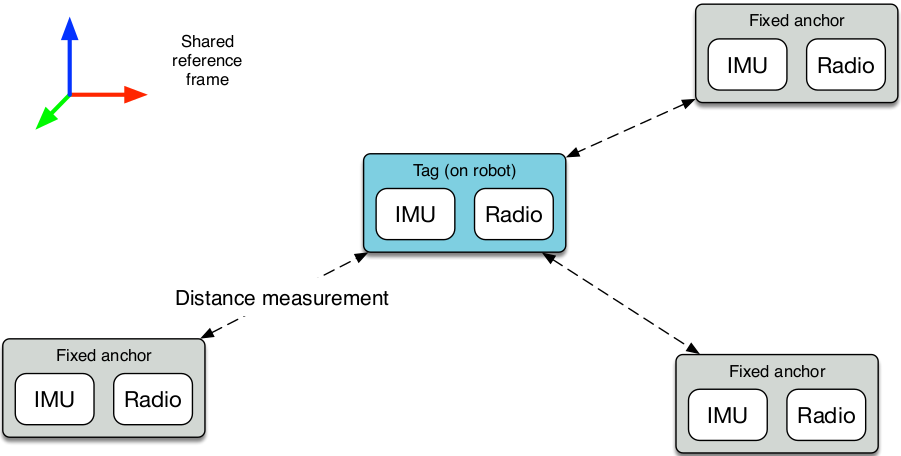

## UWB positioning system

- Drift: None ✔
- Positioning accuracy: 5cm ✔
- Total cost: 250$ ✔
- Bonus: works indoor and outdoor

#

## System design

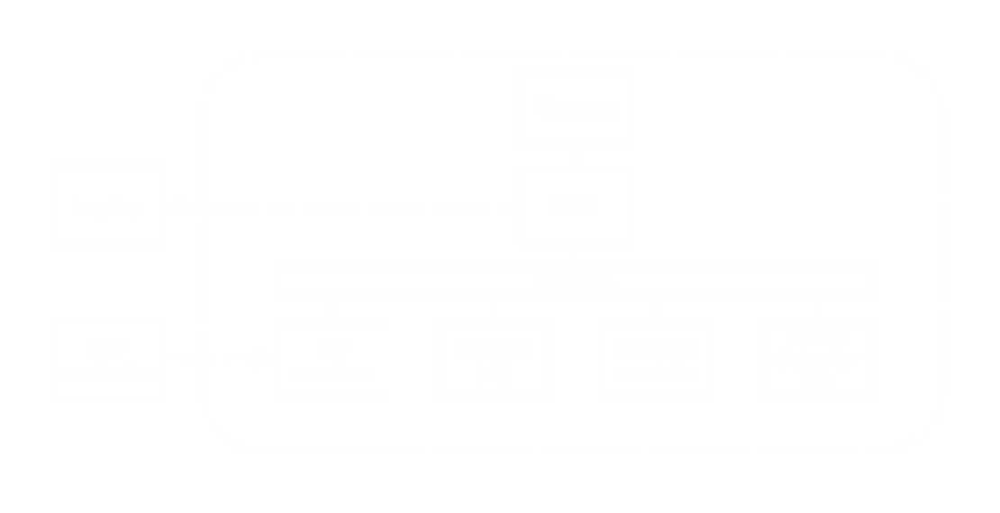

## CVRA CAN stack

Reusing our CAN boards

- UWB boards
- Motor boards
- IO board
- CAN/USB adapter

## UWB board

:::::::::::::: {.columns}
::: {.column width="35%"}

:::
::: {.column width="60%"}
- Used for positioning
- STM32F4 + ChibiOS + UAVCAN
- 50$ per board
:::
::::::::::::::

## Motor board

:::::::::::::: {.columns}
::: {.column width="40%"}
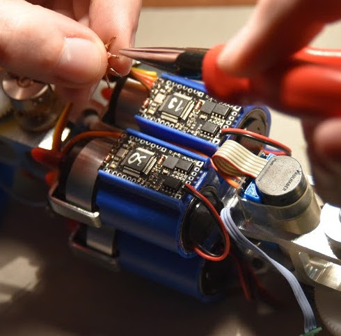
:::
::: {.column width="60%"}
- Used for motor control
- Hacked for metal detection
- STM32F3 + ChibiOS + UAVCAN
- 35$ per board
:::
::::::::::::::

## IO board

:::::::::::::: {.columns}
::: {.column width="40%"}
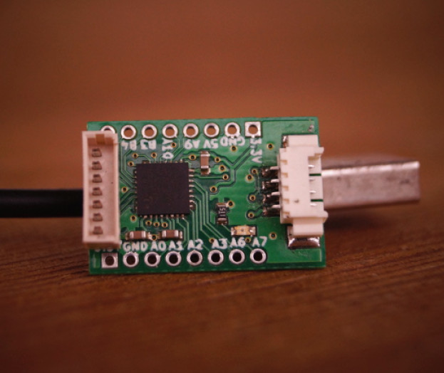
:::
::: {.column width="60%"}
- Used as RC receiver
- STM32F3 + ChibiOS + UAVCAN
- 10$ per board
:::
::::::::::::::

## CAN/USB adapter

:::::::::::::: {.columns}
::: {.column width="40%"}
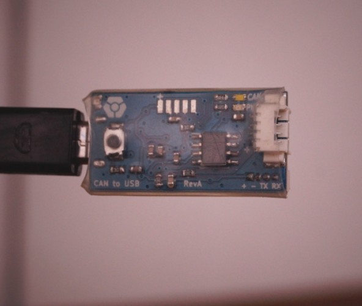
:::
::: {.column width="60%"}
- Used as PC - CAN interface
- STM32F3 + ChibiOS + UAVCAN
- 20$ per board
:::
::::::::::::::

#

## Sisyphus flies to Madrid

## Madrid

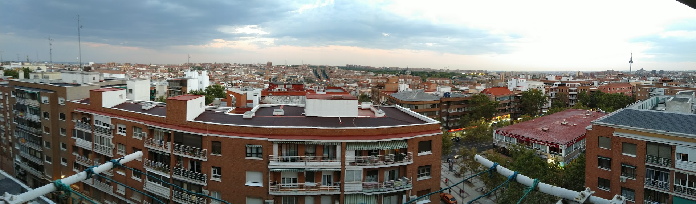

## Working at the Airbnb

## On the field

## Best Design Award

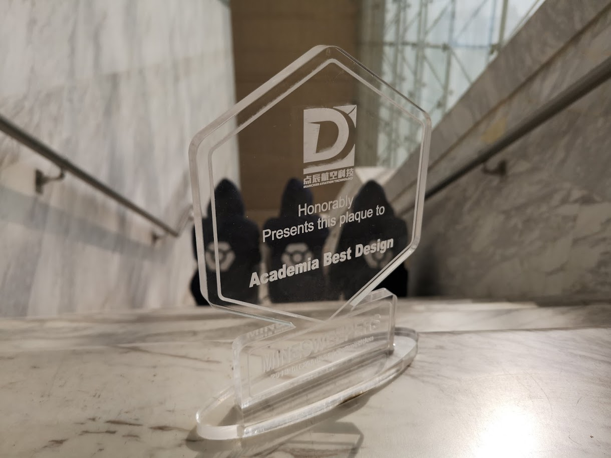

## IROS

:::::::::::::: {.columns}
::: {.column width="36%"}
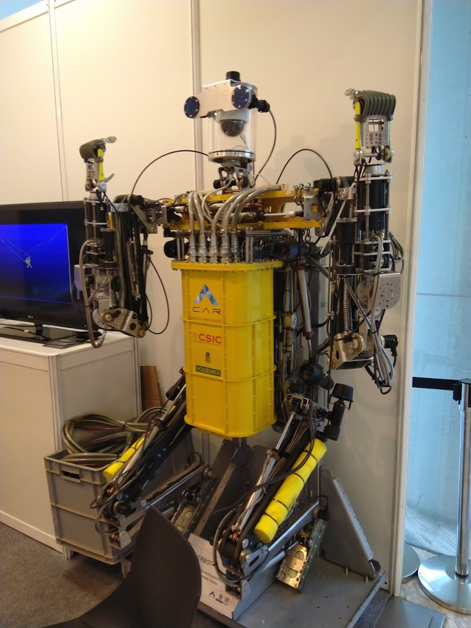
:::
::: {.column width="64%"}
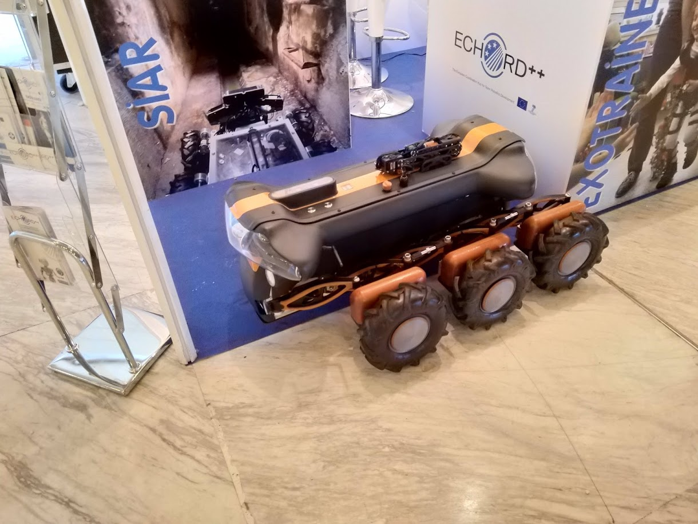
:::
::::::::::::::

## La conquista de Madrid

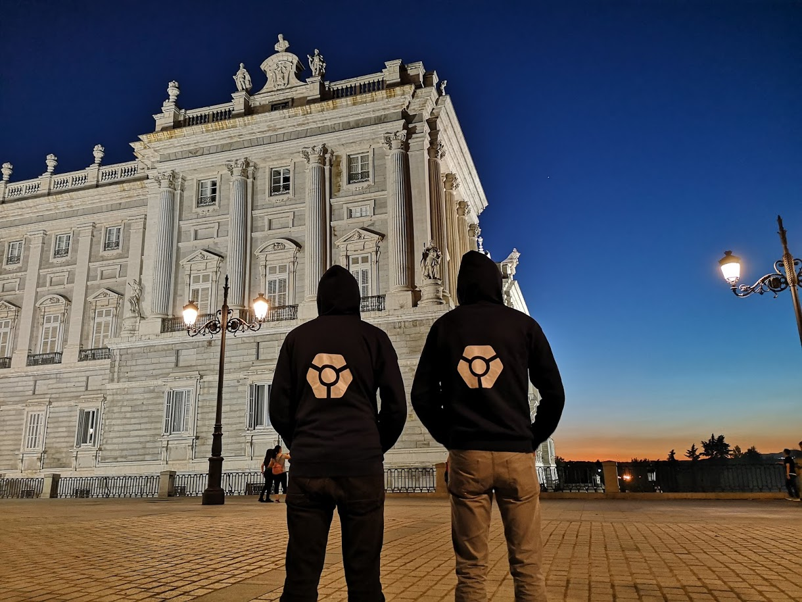

#

## Conclusion

:::::::::::::: {.columns}
::: {.column width="30%"}
**Good**

- Modular Design
- CAN bus
- 3D Printing
- RGBD Camera
:::
::: {.column width="30%"}
**Bad**

- Coil detector
- Mechanical issues
- Late integration
- Lack of testing
:::
::::::::::::::

#

## We ❤ open-source!

- Software & Electronics    [github.com/cvra](https://github.com/cvra)
- Mechanical design         [grabcad.com/cvra-1](https://grabcad.com/cvra-1)
- CVRA CAN stack            [cvra.ch/robot-software](https://www.cvra.ch/robot-software)

#

## Questions? {data-background-image="images/rgbd.jpg" data-background-opacity=0.8 data-background-size=60%}
